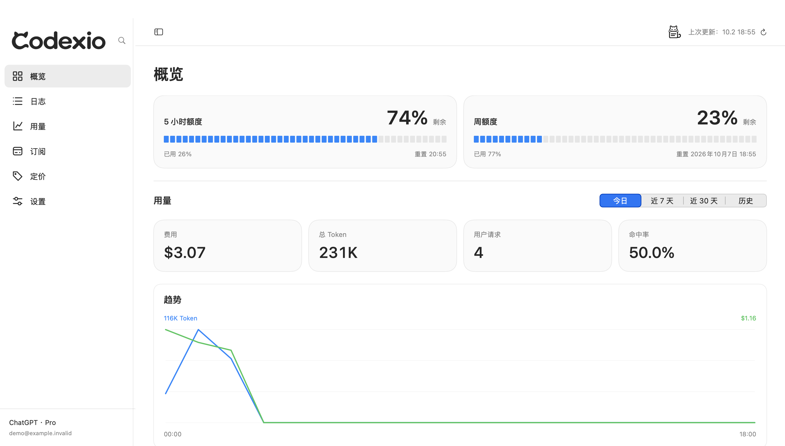

  

<h1 align="center">Codexio</h1>

看清 Codex 的额度、用量与每一次请求。

  <a href="https://github.com/Wujuhu/Codexio/releases/latest/download/Codexio.app.zip"><strong>下载 macOS 版</strong></a> ·
  <a href="https://github.com/Wujuhu/Codexio/releases/download/v0.3.5/Codexio.exe"><strong>下载 Windows 版</strong></a> ·
  <a href="https://github.com/Wujuhu/Codexio/releases/latest/download/Codexio.ipa"><strong>下载 iPhone 版</strong></a> ·
  <a href="https://github.com/Wujuhu/Codexio/releases">所有版本</a> ·
  <a href="https://github.com/Wujuhu/Codexio/issues">反馈问题</a>

Codexio 是 Codex 的用量与任务看板。它读取本机日志，汇总 Token、费用估算、请求记录和使用趋势，结合账户额度帮助你了解日常使用情况。Mac 提供菜单栏与桌面小组件，Windows 提供托盘与悬浮窗；配对 iPhone 后，还可以在手机上查看状态、阅读请求与最终回复。

macOS 主分支开发界面，使用隔离模拟数据；正式安装包的界面可能有所不同。

## 下载与安装

当前正式 Release 为 **[v0.3.5](https://github.com/Wujuhu/Codexio/releases/tag/v0.3.5)**，各平台安装包独立管理版本：

| 平台 | 已发布包版本 | 系统要求 | 安装包 |
| --- | --- | --- | --- |
| macOS | 0.3.5 | macOS 15+ · Apple Silicon（arm64） | [Codexio.app.zip](https://github.com/Wujuhu/Codexio/releases/latest/download/Codexio.app.zip) |
| Windows | 0.3.5 | Windows 10/11 x64 · WebView2 Runtime | [Codexio.exe](https://github.com/Wujuhu/Codexio/releases/download/v0.3.5/Codexio.exe) |
| iPhone | 0.3.1 | iOS 26+ | [Codexio.ipa](https://github.com/Wujuhu/Codexio/releases/latest/download/Codexio.ipa) |

**iPhone IPA 为未签名设备包，需要自行重签后安装。** 包版本、大小与 SHA-256 以 Release 中的 `latest.json` 为准。`main` 包含尚未发布的更改，源码版本号不代表已发布包版本；Windows 下载固定指向已发布的 EXE，因为后续 Apple Release 不一定附带 Windows 包。

### macOS

1. 下载并解压 ZIP，将 `Codexio.app` 放入“应用程序”后打开。
2. 在这台 Mac 上登录并使用 Codex。Codexio 会尝试发现可用的 Codex 组件，并读取本机日志。
3. 使用自定义安装或日志目录时，在 **设置 → 数据** 配置组件路径与日志目录；默认日志根目录为 `~/.codex`。
4. 在 **设置 → 菜单栏** 选择显示字段和顺序；桌面小组件可从 macOS 小组件库添加。

Mac 使用 `/Applications/Codexio.app` 作为稳定安装位置。从其他目录打开完整 App 时，会校验并接管该位置后重新启动，以保持唯一的小组件扩展。应用内更新在下载完成后由你主动选择安装。

### Windows

1. 下载 `Codexio.exe`，确认系统已安装 WebView2 Runtime，然后运行。
2. 登录并使用本机 Codex；如目录未自动识别，在设置中配置数据路径。
3. 根据需要启用悬浮窗。关闭主窗口后，可从系统托盘重新打开；退出应用使用托盘菜单。

### iPhone

1. 下载 IPA，使用重签工具安装到 iPhone。
2. 让手机与电脑处于**可互通的同一局域网**，保持电脑上的 Codexio 运行，在 **设置 → 同步** 开启同步并生成二维码。
3. 在手机点击“连接我的电脑”，允许相机和本地网络权限后扫码，再在电脑确认配对。二维码单次有效，5 分钟后过期。

配对后优先通过局域网同步。外出阅读需在电脑上单独启用云同步，并使用服务管理员提供的邀请码；手机下一次成功连接电脑时会取得云端配置。目前每台电脑最多授权 3 部手机，每部手机最多保存 3 台电脑。

## 功能概览

| 功能 | 内容 |
| --- | --- |
| **额度与任务** | 5 小时／周剩余额度、重置时间、当前任务与最近请求 |
| **请求记录** | 按日期、模型、速度和状态筛选，查看 Token、费用、思考强度、耗时与可用正文 |
| **用量分析** | 费用、总 Token、用户请求、命中率，以及趋势、活动热图、模型构成和聊天排行 |
| **AI 使用报告** | 日报、周报与月报，回顾用量和模型偏好，并导出报告图片 |
| **订阅与定价** | 订阅周期统计、模型基础价格与手动价格覆盖 |
| **桌面集成** | Mac 菜单栏字段选择与排序、请求／额度小组件；Windows 托盘、悬浮窗与贴边停靠 |
| **手机阅读** | 概览与趋势、用户消息和最终回复、可用图片预览，以及多台已配对电脑切换 |

主分支另已加入 Mac 小猫报告入口和手机阅读改进：Mac → iPhone 同步支持完整历史的聚合趋势，以及排除暂停等待的实际运行耗时；iPhone 记录补充日期、时间和耗时。这些改进不代表上方正式安装包已包含全部功能，Windows 的手机同步范围也尚未完全一致。

## 数据与隐私

**费用是按模型价格与应用规则折算的 API 等价值，不是实际账单、ChatGPT 订阅扣款或官方 Credits。** 基础价与 Codex 登录模式的 Fast／长上下文规则分别计算；第三方服务的实际计费可能不同，缺少价格时保留未定价状态。总 Token 为输入与输出之和，缓存与推理 Token 不重复累加；用户请求数与模型调用数分别统计。详见 [计价规则](docs/codex-pricing.md) 与 [数据口径](docs/v0.3.1/DATA_CAPABILITIES.md)。

Codexio 只读采集原始 Codex 日志，设置、账本和缓存保存在本机。**手机同步默认关闭，云同步需单独启用。** 启用后，配对手机可读取用量、额度、请求摘要、可用正文、最终回复与图片预览；云同步会将相应内容上传至 Cloudflare 服务，内容不会自动脱敏。

| 云端内容 | 保留与容量 |
| --- | --- |
| 请求摘要与正文 | 最长 7 天；正文每台电脑最多 64 条、合计 8 MiB，单条最多 1 MiB |
| 图片预览 | 最长 3 天；最长边 2048 像素、每张最多 1 MiB；每台电脑最多 128 张、云端预览数据合计 32 MiB |
| 用量聚合 | 范围由电脑端版本决定，不因单条消息到期而清空 |

保留期按源记录时间计算，重复上传不续期；容量限制可能使内容更早不可用。到期内容立即停止读取，实际删除由后台任务分批处理。云服务还受管理员配置、全局每日请求预算与 Cloudflare 平台限额约束，达到限制时手机保留已验证缓存。

当前主分支中，Mac 的手机趋势覆盖全部历史：近 30 天按日展示，更早数据合并为最多 60 个区间；Windows 的手机同步仍提供近 90 天趋势及 7／30／90 日统计。完整历史聚合不等于保存全部消息正文。协议、预算和容量细节见 [手机阅读与同步](cloudflare/README.md)。

局域网使用 TLS 并校验配对证书指纹，云端使用 HTTPS 和设备凭据鉴权。同步不上传原始日志文件、完整工具执行过程或 Codex 登录凭据，也不提供远程执行任务或任意文件下载。关闭同步会停止服务，已上传副本继续按保留规则清理；撤销授权不会抹除离线设备已经保存的内容。

可选的 **上游检测** 默认关闭。开启后，相关请求经本机转发以关联响应 ID 和模型名称；关闭或正常退出时恢复原服务配置。使用前可阅读 [上游检测说明](docs/upstream-detection.md)。

## 常见问题

**为什么账户额度与本机用量不同，或者额度不可用？**

账户额度可能由多台设备共同消耗，本机统计只来自当前电脑可读取的日志。ChatGPT 登录模式可查询订阅额度；API Key 或自定义 provider 模式保留本机用量统计，官方订阅额度显示为不适用。缺少日志、报告或价格时会显示未知状态。

**关闭 Mac 窗口后还会继续运行吗？**

会，主 App 可继续在菜单栏运行。⌘Q 会退出主 App，停止采集、额度查询、同步和上游转发；小组件会提示“打开 Codexio 主程序”。小组件不独立采集，也不会自行启动主 App。

**电脑关机后，手机还能看到内容吗？**

启用云同步后可读取此前上传且仍有效的内容，但不会产生新数据；未启用时可查看已有本地缓存。手机进入后台后暂停连接与轮询，返回前台恢复。

## 开发与贡献

Mac 使用 Swift／SwiftUI／AppKit／WidgetKit，iPhone 使用 SwiftUI／Charts，Windows 使用 Wails + Go 与 Svelte／TypeScript。历史 Python 实现保留为规则参考和共享资源来源。

| 平台 | 构建环境 | 开发打包入口 |
| --- | --- | --- |
| macOS | 完整 Xcode（macOS 26+ SDK）、Python 3.12／3.13 | `./build_macos.sh` |
| iOS | `/Applications/Xcode.app`、iOS 26+ SDK、项目 Python 环境 | `.venv/bin/python scripts/build_ios.py` |
| Windows | Windows x64、Go 1.26.1、Node.js/npm；脚本固定 Wails 版本 | `.\build_exe.ps1` |

Mac 入口自动创建或复用 `.venv`；Python 仅参与构建与交付，原生 App 运行不依赖 Python。开发产物位于 `build/dev/<平台>`，打包不会自动推送或发布。修改前请阅读 [AGENTS.md](AGENTS.md)，遵守平台范围、最小冒烟与交付约定；Windows 开发需单独明确授权。

欢迎通过 [Issues](https://github.com/Wujuhu/Codexio/issues) 反馈问题、建议功能或提交文档修正。问题报告请包含应用版本、系统版本与复现步骤，并移除个人请求内容和凭据。

## 文档

- [macOS 开发说明](docs/macos.md) · [iOS 开发说明](docs/ios/DEVELOPMENT_HANDOFF.md) · [Windows Wails 开发说明](docs/v0.3.4/WINDOWS_WAILS.md)
- [手机阅读与同步](cloudflare/README.md) · [计价规则](docs/codex-pricing.md) · [上游检测](docs/upstream-detection.md)
- [当前开发记录](docs/v0.3.5/DEVELOPMENT.md) · [协作与交付约定](AGENTS.md)

开发记录包含历史过程，具体行为请以对应版本的源码与安装包为准。
