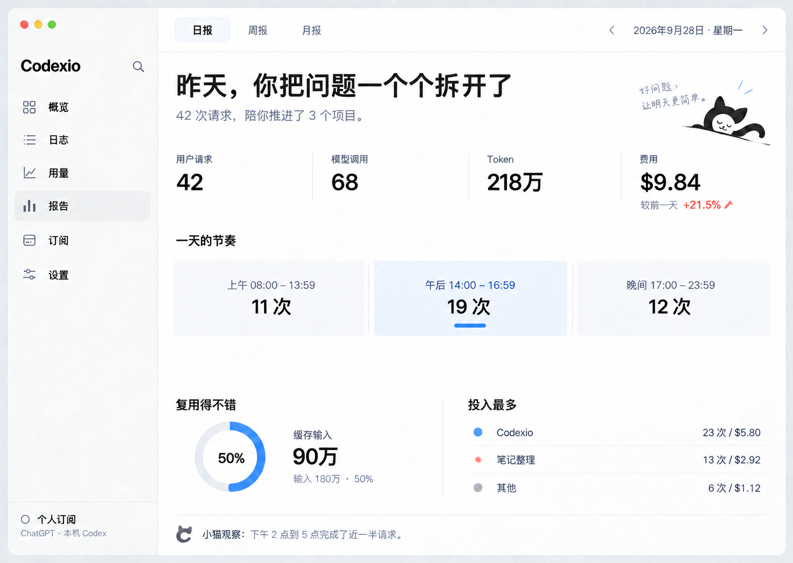
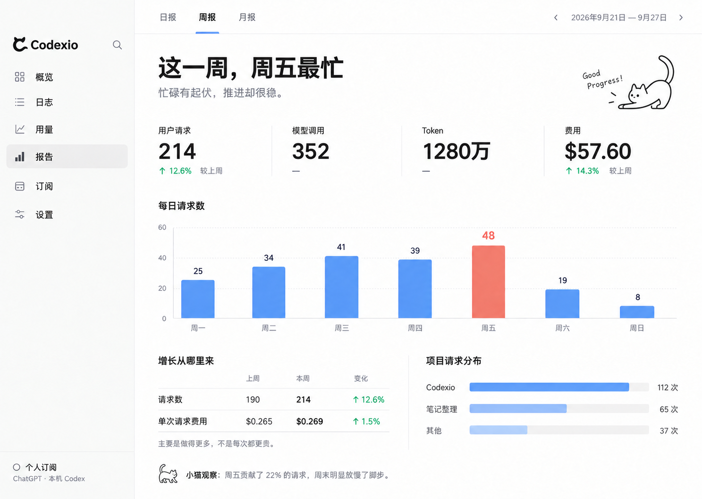
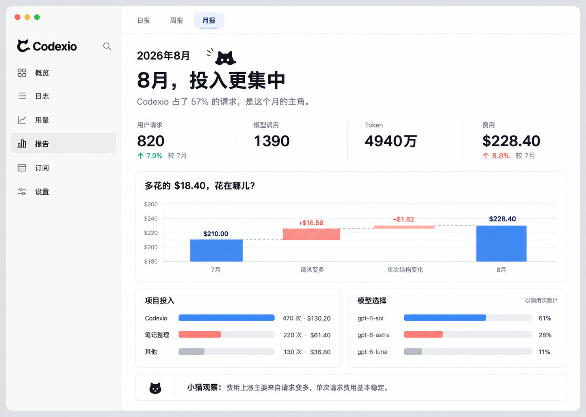

# Codexio AI 使用报告 · 视觉设计

本目录是日报、周报、月报的静态视觉提案，未接入应用。设计日期：2026-09-29（Asia/Shanghai）。演示数据是虚构数据，用来说明信息组织与洞察口径。

## 设计主张

报告先用一句话回顾最重要的变化，再给用户一张能解释这句话的主图。四个基础量（用户请求、模型调用、Token、费用）固定在同一位置，便于跨周期快速阅读。每页主图各有任务：日报看一天的节奏，周报看一周的起伏，月报解释费用变化。次级区域只留下两个值得进一步看的发现。猫咪用于情绪收尾，不遮挡数据。外壳延续现有 Codexio 概览页的侧栏、留白、字重和浅色表面，使用现有猫耳 C 品牌图形作参考。

| 报告 | 时间范围 | 首要问题 | 主图 | 额外发现 |
| --- | --- | --- | --- | --- |
| 日报 | 昨天，本机时区的完整自然日 | 昨天的使用集中在什么时候？ | 三时段请求分布 | 缓存输入占比、项目投入 |
| 周报 | 上一完整自然周，周一至周日 | 哪一天让这一周不同？ | 每日请求柱图 | 请求增长和单次成本变化、项目请求分布 |
| 月报 | 上一完整自然月 | 费用为何变化？ | 费用变化桥 | 项目投入、按调用数统计的模型选择 |

报告标题应由真实数据决定，避免每天机械套同一文案。比较口径固定为相邻、同长度的上一周期。时区变化时按报告生成时的本机时区重新确定自然日边界，并在日期旁显示时区。可切换历史周期；如果某周期无数据，用轻量空态解释“这段时间没有使用记录”，不绘制虚假的零值趋势。费用为记录的估算费用，应沿用 Codexio 当前价格和数据来源口径。

## 演示数据核对

- 日报：2026-09-28，42 次请求、68 次模型调用、218 万 Token、$9.84；前一天费用 $8.10，增长 21.5%。上午 11 次 + 午后 19 次 + 晚间 12 次 = 42 次；午后占 45.2%，界面取整为 45%。项目 23 + 13 + 6 = 42 次，费用 $5.80 + $2.92 + $1.12 = $9.84。缓存输入 90 万 / 总输入 180 万 = 50%。
- 周报：2026-09-21 至 09-27，214 次请求、352 次模型调用、1280 万 Token、$57.60；前周 190 次、$50.40。七天请求数 25 + 34 + 41 + 39 + 48 + 19 + 8 = 214；周五 48 / 214 = 22.4%。请求增长 12.6%，费用增长 14.3%；单次请求费用从约 $0.265 增至约 $0.269，约增长 1.5%。项目 112 + 65 + 37 = 214 次。
- 月报：2026-08，820 次请求、1390 次模型调用、4940 万 Token、$228.40；7 月 760 次、$210.00。请求增长 7.9%，费用增长 8.8%。费用增量 $18.40 = 请求量变化 $16.58 + 单次结构变化 $1.82；项目 470 + 220 + 130 = 820 次，费用 $130.20 + $61.40 + $36.80 = $228.40。Codexio 的请求占比 57.3%，界面取整为 57%。模型调用占比 61% + 28% + 11% = 100%。

“费用变化桥”的量效分解为：请求量变化 =（本期请求数 − 上期请求数）× 上期平均单次请求费用；单次结构变化 = 总费用变化 − 请求量变化。这里的“结构”是残差，可能由模型选择、Token 量、输入输出比例、缓存和价格规则共同造成；不能在没有进一步拆分时把它归因于单一模型。

## 设计落地时的边界

- 图上的请求数量沿用 Codexio 的请求分组口径，不把模型调用数当作用户请求数。
- 缓存命中率以缓存输入 Token / 全部输入 Token 计算，并写明分母；不把缓存量算作省下的金额，除非按同一价格版本计算反事实差额。
- 项目和聊天名称来自真实身份映射；无法归属的调用单独列出，不能硬塞进“其他项目”。本视觉稿的“其他”只是演示数据中的已归属小项目合并。
- 额度状况、任务耗时、运行状态、推理强度和速度模式可在某期出现异常变化时进入洞察位置；没有显著变化时不占据首页。
- 文案基于已计算的数字和确定性阈值生成；用户可以点开图表查看明细，不在悬停时重新扫描日志或查询整份历史。
