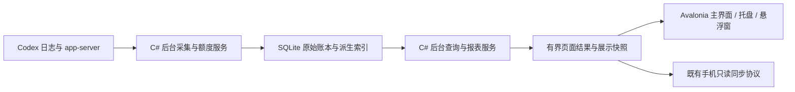

# Windows v0.3.4 功能整理与重构方案

日期：2026-09-30（Asia/Shanghai）。状态：已完成代码同步、问题核对与技术方案评估，待选择技术路线；尚未实施重构或生成新 EXE。

## 目标与约束

用户本轮指定 v0.3.4，只处理 Windows EXE。解决启动、交互和长时间运行的卡顿，替换 PySide，选择可以继续支持 Windows/Linux 的成熟桌面方案。macOS 保持现有 Swift/SwiftUI/AppKit 实现，本轮不改 Mac、iOS 或云端部署。

新增规则：自动审批审查有可靠归属时合并到对应用户请求；不能可靠关联时显示“自动审批审查”；两种情况下都不增加用户请求数，实际计量保留。

本轮 Windows 交付遵守用户提供的目录约定：通过 `build_exe.ps1` 构建到 `build/release-staging`，再由 `scripts/publish_exe.ps1` 交付 `dist/Codexio.exe`；`dist` 只有这一个 EXE，清单为 `dist/latest.json`。文件占用时保留原文件和暂存新版，由用户自行退出原应用。临时文件、缓存和旧包留在 `build`。

用户已明确版本目标为 0.3.4；技术评估不提前修改运行版本。后续只更新 Windows 版本，不改 `macos/VERSION`、`ios/VERSION` 或 Widget 构建号。实现、验证及开发打包完成后本地提交；推送、Tag、Release 和远程部署仍需用户新的明确授权。

## 已核对的基线

- 本地 `main` 已从 `76b0d26` 快进至远程 `0d67bed5935836ff1fdf1d1963e2cf44612b385f`，最新 Windows 源码版本为 0.3.3。
- 当前运行文件为用户下载目录中的 `Codexio.exe`，Windows 文件属性 ProductVersion/FileVersion 均为 0.3.3。开发检查没有结束或重启它。
- GitHub v0.3.3 当前正式附件为 `Codexio.app.zip`、`Codexio.ipa`、`latest.json`，没有 EXE，符合用户已撤回 Windows 包的说明。
- 当前界面仍为 Python/PySide6。采集、增量计价、SQLite 物化索引、分页和业务变化检测已有实现，应移植这些机制，不从零重新定义计量规则。
- 主要参考为 `src/codexio/{usage_collector,usage_worker,usage_queries,user_requests,pricing}.py`、`docs/v0.3.3/WINDOWS_PARITY.md` 及 `docs/v0.3.1/PERFORMANCE.md`。

## v0.3.4 功能范围

以下“保留”表示最新版源码已有能力需要在新 Windows 实现中承接，不表示本轮已经重新验收。

| 范围 | v0.3.4 要求 |
| --- | --- |
| 概览 | 保留费用、总 Token、用户请求、缓存命中率、额度卡片和最近最多三条主请求；请求计数使用新的审查分类规则。 |
| 日志 | 保留用户请求/模型调用视图、日期/模型/速度/状态筛选、搜索、可调列宽、有界分页和按需详情；保留模型、推理强度、速度、上下文和上游观测。 |
| 自动审批审查 | 新增明确类型；可靠关联后进入主请求的调用组成，无法关联则独立显示“自动审批审查”；不进入用户请求数或最近用户任务。 |
| 上下文压缩 | 沿用已有独立类型，保留计量，不增加用户请求数。避免新审查分类破坏压缩、续接、别名与子代理分组。 |
| 用量 | 保留周期汇总、趋势、活动热图、本地洞察和模型贡献；读数据库和整段聚合移到后台，鼠标悬停只读取已准备的数据。 |
| 订阅 | 保留五小时/周额度、周期历史、重置券及已有主动重置确认行为、官方只读用量报告和周额度估值。API Key 账户继续显示额度不适用。 |
| 定价 | 承接最新 GPT-6.1 Sol 和现有价格规则；保留 Standard 基础价、Codex Fast/长上下文倍率、第三方参考价以及未定价/部分定价状态；不在迁移中重新发明价格。 |
| 日报/周报/月报 | 保留昨天、上一完整自然周/月、每日 08:00 后首次打开的呈现规则、三套猫咪素材、默认第 3 套、长卡片、侧栏控件和 PNG 分享；只加载当前需要的图片，关闭后释放。 |
| Windows 桌面能力 | 保留托盘、悬浮窗、吸附停靠、主题、中英文系统语言、图标/字标、窗口位置及用户偏好。 |
| 自动更新 | 保留检查后由用户选择更新/稍后、真实进度、大小/SHA-256/程序头校验、正常退出后替换、启动确认和失败回滚。开发包不触发正式更新。 |
| 手机只读同步 | 承接 Windows 现有配对、撤销、局域网/云端摘要及按需详情协议；不新增远控，不改 iOS 或部署 Worker。新请求计数口径与桌面一致。 |
| 数据兼容 | 继续识别现有 `Codexio`、`AIQuotaWidget`、`AIQuota` 数据目录与 `CODEXIO_DATA_DIR`；保留设置、历史账本、上游观测及配对凭证。移除的 SSH 管理不重新加入。 |
| 性能与交付 | 替换 PySide；无变化不重读日志、不重新计价、不重建列表/图表；用单个 Windows EXE 交付，Linux 只保留架构适配能力，本轮不声称已通过 Linux 验收。 |

“AI 报告”是现有功能名称；当前实现从本地统计生成报告，不因重构额外添加在线模型调用。

## 自动审批审查：证据与规则

### 当前误分类链路

在本机 2026 年 9 月日志的元数据中找到 7 个明确 Guardian 会话。其来源格式为：

```json
{"source":{"subagent":{"other":"guardian"}},"parent_thread_id":"<父聊天 ID>"}
```

其中记录到的模型包含 `codex-auto-review`。当前 `usage_collector.py:_turn_source` 只识别 `source.subagent.thread_spawn`。对这些实际元数据调用解析函数，输出的 `is_subagent` 为 false，`parent_session_id` 为空；父聊天信息被丢弃。`user_requests.py` 对有归属 ID 且不是上下文压缩的组默认给出 `user_request`，计数查询又只排除子代理，因此自动审批审查存在进入普通用户请求的路径。

采样的这 7 个 Guardian 会话有父聊天 ID，但没有明确的父轮次 ID。父聊天可以包含多个用户请求，不能据此把审查随意并到某一轮。这次复现证明了解析缺口，未修改现有数据，也没有声称截图对应的那一条已修好。

### 新分类与归属

1. 原始会话元数据保留结构化来源、父聊天、明确父轮次、调用关联和继承边界。`other=guardian` 是已确认的识别依据；未来格式应有单独兼容处理。
2. 明确的 `codex-auto-review` 调用可作为缺少会话来源时的分类回退信号。聊天标题或用户正文中出现 “Guardian review” 本身不足以分类；用户可以正常讨论这些文字。
3. 独立使用 `automatic_approval_review` 类型，不借用普通子代理、上下文压缩或用户请求类型。保留审查角色，即使它属于内部子任务。
4. 只在明确父轮次、显式调用关系或可核对的继承边界唯一确定主请求时合并。仅父聊天、相邻时间、相同摘要、同一模型或 cwd 不构成合并依据；多个候选时保留独立审查。
5. 合并时以调用 ID 去重，进入原请求的调用组成，并可显示“含 N 次自动审批审查”。主请求正文、请求模型和最终回复保留用户任务含义；审查正文或审批结果不替换它们。
6. 无法合并时行标题和详情类型显示“自动审批审查”，可以查看实际模型、时间、Token、已知费用及“未能明确关联父请求”。父数据稍后采集到后按依赖变化重新判定。

### 统一计数和费用

- 用户请求数只统计真实主用户请求；子代理、自动审批审查、上下文压缩和未归属调用均不新增用户请求数。
- 一次用户请求附带两次审查，仍计 1 次用户请求；独立审查计 0 次用户请求。日志页可以另外显示审查数量。
- 原始调用账本中的审查 Token 保留。全局 Token/已知费用按去重调用计算，不把请求组的累计再加一次。
- 无可靠官方价格时保留“未定价”；主请求含未定价审查时显示部分定价及已知金额，不把未知费用当 0，不用普通 GPT 型号替代 `codex-auto-review` 计价。
- 概览、趋势、模型贡献、活动统计、日报/周报/月报、托盘/悬浮窗最近任务、手机只读同步采用同一分类口径。模型调用视图仍可显示审查的实际调用。
- 审查自身的耗时/运行状态属于调用详情；不简单累加到主任务墙钟耗时，不让独立审查取代最近真实用户任务。
- 原始账本保持权威。迁移只重建必要派生索引；旧元数据缺少来源时有界补读相关会话元数据，不为修正分类无条件重扫全部历史。

## 性能排查结果

在运行中的 0.3.3 使用的数据目录内，通过最新版源码查询接口进行了单项只读耗时测量。采样规模为 7,569 条调用、1,152 条轮次、1,038 个请求组，主数据库约 139 MB。每项测两次，依次执行；操作系统/SQLite 缓存未清空，因此“第一次”不等于严格冷缓存。主应用继续运行，以下不是整个 EXE 的性能基准，也不是新旧框架对比。

| 查询 | 第一次 | 第二次 |
| --- | ---: | ---: |
| 今日汇总 | 15.0 ms | 3.9 ms |
| 全历史汇总 | 147.6 ms | 147.3 ms |
| 全历史周图表 | 600.2 ms | 222.5 ms |
| 100 行请求分页 | 21.6 ms | 16.6 ms |
| 最近三条请求 | 8.7 ms | 7.5 ms |

`dashboard.py:_render_overview`、`_render_log_page` 和详情打开/翻页事件直接调用 SQLite 查询；历史汇总及图表还进行 Python 数据解码/聚合。查询单项已可能占住界面线程约 0.15–0.60 秒，同一界面更新包含多个查询。`UsageQueries._connect` 的数据库等待上限为 30 秒，遇到锁竞争时存在进一步放大界面等待的风险；本次没有复现该锁等待。

当前版本已有 `content_changed`、日志变化检测、增量计价、分页等优化，不能把它描述成每次轮询都重新处理全部历史。已有优化应迁移。单项证据能解释部分切页卡顿，尚不能解释全部启动或长时间运行问题，也不能据此宣称 PySide/Qt 本身是唯一根因。

重构同时要调整数据调度：所有日志读取、数据库访问、JSON 解析、网络、图表/报告计算在后台；界面只接收结果。后台采集不得触发不相关页面重算。新筛选请求取消或作废旧结果，查询结果按账本 generation、价格规则、筛选、来源、时区及必要时间边界缓存，缓存有界。

## 技术方案判断

### 常驻桌面资源与 C# 业务整合优先时：Avalonia + .NET 10 LTS + SQLite

这是针对本项目的选择判断，不是已经测得的框架速度排名。项目主体是桌面数据表格、图表、托盘/悬浮窗和长期后台采集；当前 Qt 控件不能直接搬到任何另一框架，也没有现成 Web 主界面值得围绕它选型。

Avalonia 支持 Windows/Linux 桌面，Windows 使用 Win32 后端，Linux 默认 X11/XWayland。界面由跨平台渲染系统绘制，并非全部使用操作系统原生控件。当前官方文档把原生 Wayland 后端列为实验性，未来 Linux 首先按 X11/XWayland 验收。Windows 10 与部分旧 Windows 11 的支持级别低于最新 Windows 11，需要明确最低系统目标。[Avalonia 平台支持](https://docs.avaloniaui.net/docs/supported-platforms)、[Linux 后端说明](https://docs.avaloniaui.net/docs/platform-specific-guides/linux)。

.NET 10 是当前 LTS，官方支持到 2028-11-14。C# 可以把 SQLite 查询、进程通信、日志增量读取、HTTP/TLS 和界面放进一个成熟的运行时；Windows/Linux 共用业务实现，平台接口保留少量适配层。[.NET 支持政策](https://dotnet.microsoft.com/en-us/platform/support/policy/dotnet-core)。

Windows 用自包含单文件发布，用户无需预装 .NET；原生渲染/SQLite 依赖须配置嵌入及运行时解出。单 EXE 不等于运行时完全不解出文件。首次发布先采用常规自包含模式并评估包体/启动成本，不同时引入 NativeAOT、激进裁剪或运行时压缩等新变量。[.NET 单文件部署](https://learn.microsoft.com/en-us/dotnet/core/deploying/single-file/overview)。

新前端与业务层均以 C# 承接，Python 代码作为迁移时的规则参考；不长期捆绑一个 Python/PySide 后台进程作为第二套运行时。macOS 的 Swift 实现继续独立维护，通过既有数据字段、价格规则及同步协议保持口径一致。

### 可选方案

| 方案 | 优点 | 本项目的代价/边界 | 判断 |
| --- | --- | --- | --- |
| Avalonia + C# | Windows/Linux 桌面能力、表格与后台服务集中在 .NET；可自包含单 EXE；没有浏览器页面层。 | 业务和 UI 需要迁移；Skia/SQLite 原生库需要正确打包；Linux 桌面集成需单独验收。 | 常驻资源和 C# 业务整合优先时推荐。 |
| Electron + TypeScript + Web 前端 | 成熟的 Web 桌面应用路线，图表、表格、Markdown、报告导出及开发工具适合当前功能；Windows/Linux 随应用带入 Chromium，渲染引擎版本可控。 | Chromium/Node.js 和多进程增加运行时及包体开销；每个 BrowserWindow 会创建渲染进程。资源目标需要实测；便携单 EXE 的更新需自行适配。 | 进入最终候选；复杂界面与生态优先时可以优先于 Avalonia。 |
| Tauri 2 + Rust + Web 前端 | 可在 Rust 侧处理采集/SQLite，Web 图表、Markdown 和报告排版生态丰富。 | Windows 依赖 WebView2，Linux 使用 WebKitGTK；小 EXE 不代表总内存必然更小。当前没有可直接复用的完整 Web 主界面，要维护 Rust、前端、IPC 和多种 WebView 行为。 | 希望使用 Web UI、重视分发包体且能接受 Rust/WebView 适配时考虑。 |
| Qt 6 + C++/QML | 成熟跨平台桌面框架，可以去掉 Python 层。 | 仍需重写业务及控件绑定；QML/Qt 模块部署、单 EXE 交付和维护成本较高。现有主线程查询问题仍要修。 | 可行，但本次没有足够收益支持把维护转到 C++。 |

Tauri 平台依赖来自 [WebView 版本说明](https://v2.tauri.app/reference/webview-versions/)，Qt 平台及模块交付来自 [支持平台](https://doc.qt.io/qt-6/supported-platforms.html)、[应用部署](https://doc.qt.io/qt-6/deployment.html)。资源和维护取舍是本项目的判断，不是同条件跑分。

### Electron 的适合度与交付边界

Electron 应纳入重点候选，不能仅凭带入 Chromium 就判定不适合。本项目已经包含六个数据页面、富文本请求详情、图表、长图报告和手机同步，Web 界面与 Node.js 后台生态有实际价值。主进程提供窗口、菜单和托盘能力；窗口内容在渲染进程中执行。[Electron 进程模型](https://www.electronjs.org/docs/latest/tutorial/process-model)。

交互流畅度、常驻 CPU、常驻内存和包体是不同指标。Electron 可以实现流畅交互；Chromium 带来的基础开销也需要计入。同样把历史数据库查询或日志解析放在主进程/渲染进程，仍会阻塞交互。采用此路线时，主进程负责窗口/托盘和调度，采集、SQLite 及聚合放在工作线程或 utility process，前端只接收有界分页和展示结果；无数据变化时不发布全局状态，不让隐藏窗口持续计算。[Electron 性能指南](https://www.electronjs.org/docs/latest/tutorial/performance)。

electron-builder 的 `portable` 可以交付免安装单 EXE，满足本轮 `dist` 中只有一个 EXE 的规则；单文件分发不等于运行时只有一个文件或进程。便携目标没有现成的自动更新路径，需要移植既有清单校验、正常退出、替换、启动确认和回滚流程，不能直接套用安装版 electron-updater。[electron-builder 交付目标](https://www.electron.build/docs/targets/)。这属于选型代价，不构成直接排除 Electron 的理由。

### 其他常用桌面框架

下表是针对 Codexio 当前 Windows/Linux、长期常驻、复杂数据界面及迁移成本的判断，未做框架同条件跑分。

| 框架 | Windows/Linux 路线 | 对 Codexio 的适合度 |
| --- | --- | --- |
| Flutter / Dart | 正式支持两个桌面平台；桌面插件/原生接入承接系统功能。 | 中等。适合统一自绘界面；本轮不迁移 Mac/iOS，托盘、停靠、表格与富文本能力需逐项核对。 |
| Wails / Go + Web | 支持 Windows/Linux，Go 业务与 Web 前端结合。 | 中等。希望使用 Go 后台时可考虑；本项目没有 Go 资产，尚无明确收益支持优先于 Electron/Tauri。 |
| wxWidgets / C++ | 跨平台 API，使用各平台原生控件。 | 中等。传统工具界面适合；当前品牌、报告和定制图表需要较多额外实现。 |
| GTK 4 / C、Rust 等 | GDK 提供 Windows 及 Linux X11/Wayland 后端。 | 较低。Linux 桌面项目可优先考虑；本轮以 Windows 体验和交付为中心，集成与打包需额外投入。 |
| JavaFX / Java | 跨平台 JVM 桌面路线。 | 中等。适合已有 Java 团队；当前没有 Java 资产，运行时与 UI 迁移没有明显复用收益。 |
| Compose for Desktop / Kotlin | 支持 Windows/Linux/macOS 桌面，声明式 UI。 | 中等。适合已有 Kotlin/JVM 团队；本项目没有相关代码需要承接。 |
| WPF / C# | 官方仅 Windows。 | Windows 单独开发合适；不满足本轮要求的 Windows/Linux 共用界面。 |
| WinUI 3 / C#、C++ | Windows App SDK 中的 Windows 桌面 UI。 | 原生 Windows 方案合适；不提供所需的 Linux 共用路线。 |
| WinForms / C# | Windows 桌面框架。 | 传统 Windows 工具适合；本项目的跨平台要求及定制数据界面使其不成为候选。 |
| .NET MAUI / C# | 标准支持 Windows、Mac Catalyst、Android/iOS；已有实验性 Linux GTK4 后端。 | 较低。Linux 后端目前不是微软官方支持的稳定平台，与本轮“成熟 Windows/Linux”的要求不符。 |

平台事实参考：[Flutter 桌面](https://docs.flutter.dev/platform-integration/desktop)、[Wails](https://wails.io/docs/introduction/)、[wxWidgets](https://wxwidgets.org/about/)、[GTK 架构](https://www.gtk.org/docs/architecture/index)、[JavaFX](https://openjfx.io/)、[Compose Multiplatform](https://github.com/JetBrains/compose-multiplatform)。Windows 框架参考：[WPF](https://learn.microsoft.com/en-us/dotnet/desktop/wpf/overview/)、[WinUI 3](https://learn.microsoft.com/en-us/windows/apps/winui/winui3/)、[WinForms](https://learn.microsoft.com/en-us/dotnet/desktop/winforms/overview/)、[MAUI 实验性后端](https://learn.microsoft.com/en-us/dotnet/maui/developer-tools/platform-backends/?view=net-maui-10.0)。

当前收敛为 Avalonia 和 Electron 两个重点候选：以常驻桌面资源和 C# 业务整合为主时继续优先 Avalonia；以 Web UI、报告/富文本生态和迭代便利为主时优先 Electron。Tauri 保留为重视分发包体的 Web 路线。以上选择不承诺尚未测得的启动、内存或节能倍数。

## 推荐架构与迁移边界（采用 Avalonia 时）



- 使用一个主应用宿主。后台任务由主应用拥有并在退出时取消、等待及回收；关闭主窗口可以继续托盘运行，退出应用则停止自己的全部服务与子进程。
- 业务核心负责计量去重、请求/审查分类、定价、缓存和报表，不依赖 Avalonia 控件。UI 不持有整份历史，详情按需加载，表格使用分页和可见控件复用。
- 使用 SQLite WAL、明确事务和单写入调度；派生索引的更新与发布保持一致。同一条调用只进入账本一次，重新分类不重写原始计量。
- 复用既有目录/文件/WAL 指纹、追加游标和有界重新发现，正确处理新增、归档、替换、截断、删除和迟到记录。文件监听只负责提示检查，不作为唯一正确性依据。
- 原始数据库与已有设置先备份，再做最小的兼容迁移。索引可重建；配对凭证、报告偏好、图标、价格覆盖和窗口偏好需要单独映射。Windows 的凭证继续使用 DPAPI；未来 Linux 由平台适配器承接。
- 主窗口、托盘、悬浮窗、后台额度服务、手机同步使用同一展示快照和请求分类。过期、失败、恢复、跨日、时区变化及账户变化正常失效；没有业务变化不发布整份 UI 状态。
- 承接现有品牌 SVG 和报告素材，避免迁移时同时做全新视觉设计。技术路线确定后再选择对应的稳定 Avalonia 包版本和所需控件。

迁移应先打通“启动 → 现有数据读取 → 日志/主请求 → 额度 → 关闭重开”，再承接图表、报告、桌面集成、更新和同步。v0.3.4 交付前要覆盖上述保留能力，不能把只完成六页空壳的包当作完整替代版。执行细化属于技术路线确认后的实施计划。

## 验证与验收

本轮评估已做：Git 同步、源码/运行文件版本核对、Release 附件只读核对、真实 Guardian 元数据的解析复现、单项 SQLite 查询耗时。没有运行全量测试、修改真实 Codex 配置或启动第二个真实应用。

实施后继续遵守仓库最小验证要求：只保留隔离模拟数据下的三个冒烟事项——程序启动、基本数据显示、主窗口关闭与重开；不恢复 pytest 或新增维护性测试套件。

针对用户明确提出的问题，另做一次性、有界的验收与交付核对：

- 对有明确父轮次、只有父聊天、孤立审查和普通用户正文含 Guardian 字样的情况核对归属与计数。分类前后原始调用数量、实际 Token 和已知费用不因重复累计发生变化。
- 用同一数据库副本、明确数据规模/缓存条件，核对历史页面切换、筛选和详情加载；界面不能等待历史扫描或整段查询。目标是操作在 100 ms 内给出反馈，后台结果按准备情况呈现；这是待验证目标。
- 用无新数据、已预热、网络稳定的条件观察长时间运行，确认没有反复扫描/聚合/重绘和持续内存增长；分别记录主应用与它拥有的子进程，避免把瞬时工作集当作整机能耗。
- 缓存存在时尽早显示可用数据，额度网络等待与首次历史索引不阻塞主窗口。启动耗时、内存和 EXE 大小实测后报告，不承诺尚未测得的速度/节能倍数。
- 验证 EXE 版本、程序头、大小、SHA-256 和清单一致。只更新清单 Windows 字段，保留现有 `macos`/`ios` 字段。文件占用时沿用原文件、保存暂存版；自更新的替换/回滚仍需 Windows 实际验收。

待确认的核心选择只有技术路线：采用推荐的 Avalonia/C#，或根据界面生态优先级选择 Electron/TypeScript；Tauri/Rust 保留为其他可选路线。功能范围与自动审批审查口径已按本轮用户要求写明；远程发布不包含在本轮授权中。
