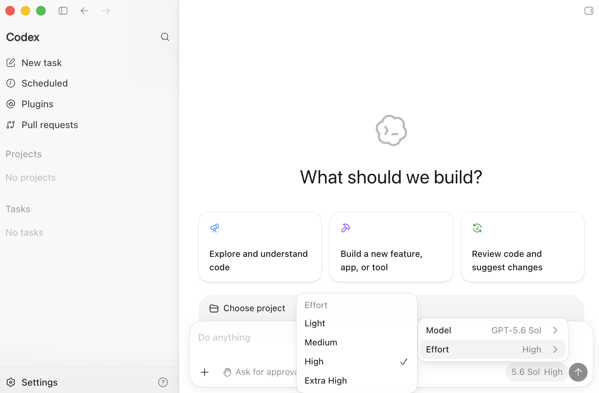
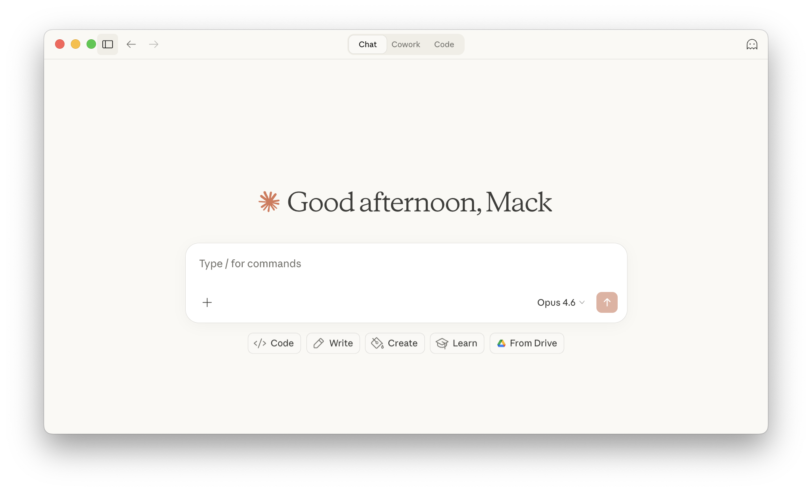
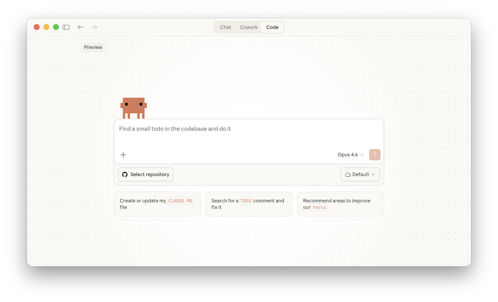
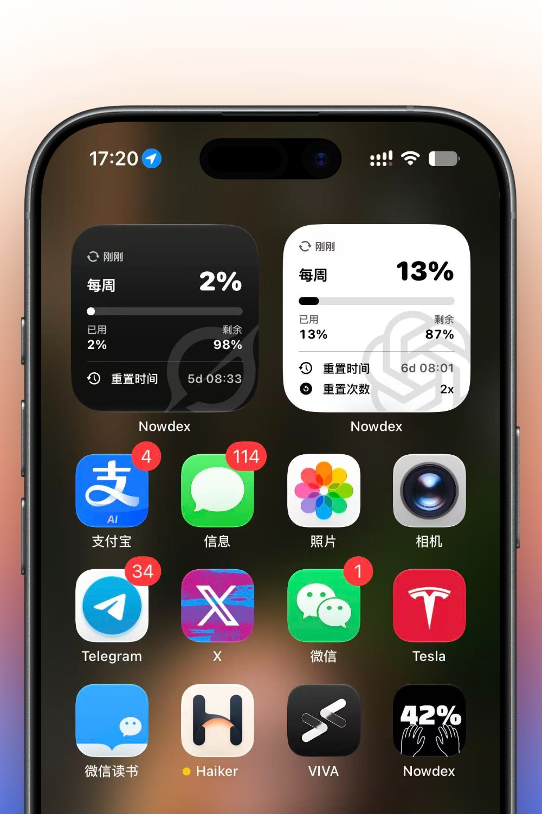
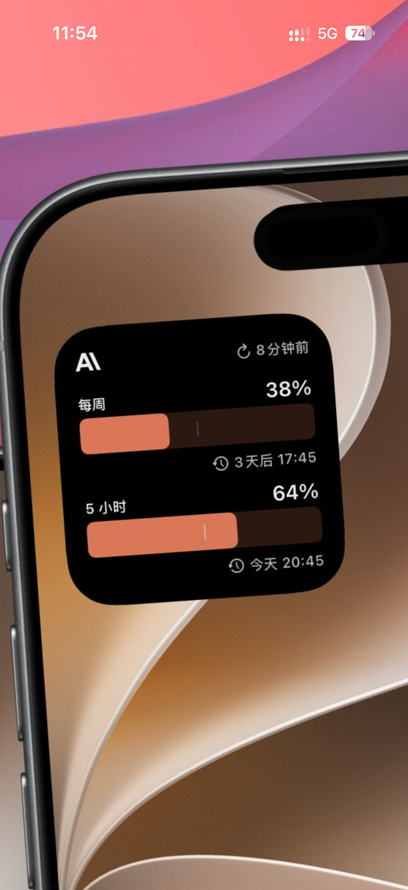
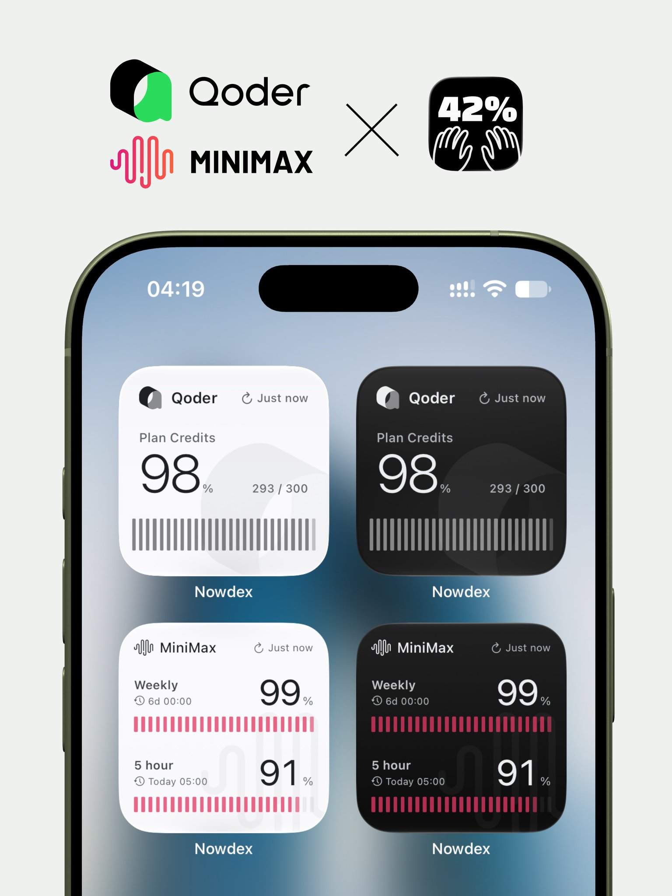
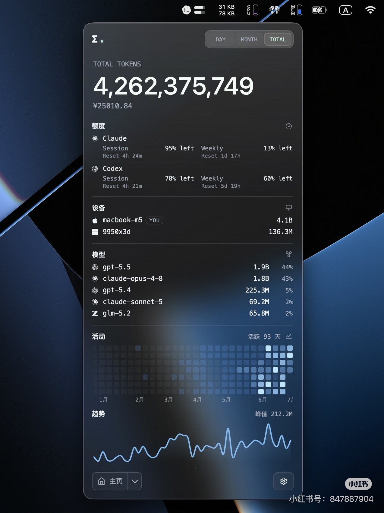

# v0.3.1 全区域视觉对照与结构草图

> **当前是结构草图，视觉源以实际客户端和公开找到的真实截图为准。** 先前自造的淡蓝卡片视觉稿已被用户否定并撤回。本文件决定 Codexio 功能放在参考 UI 的哪个位置，不能替代 Codex／Claude／Nowdex 的真实截图。用户已选择当前新版 Codex；设计未获用户整体认可前不改程序代码。

所有界面同时提供简体中文与英文。参考图的版式、留白与字级层次继续作为视觉目标；**Mac 实际文字一律使用 macOS 系统默认字体**，不直接采用 Claude 截图中的装饰字体。Windows 使用系统界面字体。按钮“使用重置 / Use reset”及其他固定文案以 [LOCALIZATION.md](LOCALIZATION.md) 为准。

[中英文静态界面稿](mockups/README.md)现已覆盖六页、设置三分区、日志常态与悬停详情以及菜单栏。它们用于确认文字是否换行、额度数字层级与详情出现方式；现有请求小组件的 UI 与 Nowdex 原图仍分别按本文件的保留和参照规则执行。

## 1. 直接视觉来源

| 表面 | 直接视觉源 | 必须照着做的元素 | 允许替换的元素 |
| --- | --- | --- | --- |
| 主窗口外壳、侧栏、导航、标题栏 | 当前新版 Codex；[官方版本说明](https://help.openai.com/en/articles/20001276-moving-to-the-new-chatgpt-desktop-app)、[新版截图来源](https://aws.amazon.com/blogs/machine-learning/get-started-with-openai-gpt-5-6-sol-terra-and-luna-on-amazon-bedrock/) | 侧栏宽度与收起方式、导航行高度、选中与悬浮状态、工具栏对齐、主内容留白 | 品牌和六个页面名称 |
| 内容详情、设置、弹窗 | Claude Desktop；[官方桌面教程和截图](https://claude.com/resources/tutorials/navigating-the-claude-desktop-app) | 字级关系、分组、表单行、详情阅读宽度、按钮克制程度 | 真实 Codexio 数据和操作 |
| 新额度小组件 | 用户 [#1](references/01-single-quota.jpg)、[#2](references/02-dual-quota.png)、[#5](references/05-segmented-styles.jpg) | 卡片比例、明暗配色、标题和大数字位置、进度条形态、细字、弱水印 | Codexio 名称、额度窗口与数值 |
| 菜单栏面板 | Nowdex [#6](references/06-menu-bar.jpg) + 新增[玻璃面板](references/12-glass-menu.jpg) | 圆角分组、Liquid Glass 透光和边缘高光、细条、今日卡和七日曲线 | 额度组叫 Codex；状态项默认周剩余百分比 |
| 用量活动／套餐历史／聊天排行 | ChatGPT [图 5](references/14-chatgpt-activity.png)／[图 6](references/15-chatgpt-plan-history.png)／[图 7](references/16-chatgpt-thread-ranking.png) | 横向指标、热力图、轻分隔表格、行内展开 | 活动改算本地；额度归因使用服务端字段 |
| 旧请求小组件小／中／大 | 当前运行版 Codexio | **UI 整体不变**，包括字号、内容顺序、间距、颜色和进度样式 | 仅必要的 Swift 数据接口与兼容代码 |

第三方客户端的聊天框、项目、服务列表、账户信息不进入 Codexio。这里的“直接照着做”针对适用的视觉结构与交互状态；当某个参考功能在 Codexio 中不存在时，用当前产品的同类数据占据对应位置，不凭空增加新业务。

### 找到的公开桌面截图

- [新版 Codex 本地参考图](references/07-codex-current.png)，来源：[AWS 官方文章](https://aws.amazon.com/blogs/machine-learning/get-started-with-openai-gpt-5-6-sol-terra-and-luna-on-amazon-bedrock/)。这张显示新版 Codex 模式的侧栏和主内容区。
- [Claude Desktop 本地首页图](references/08-claude-home.png)与[本地工作区图](references/09-claude-workspace.png)，来源：[Claude 官方教程](https://claude.com/resources/tutorials/navigating-the-claude-desktop-app)。下载地址与 SHA-256 见 [参考图来源](references/SOURCES.md)。
- 若公开图未展示某个必要的设置或详情状态，优先参照大厂开源的 [Microsoft Code - OSS 工作台](https://github.com/microsoft/vscode)及其[界面指南](https://github.com/microsoft/vscode-docs/blob/main/api/ux-guidelines/overview.md)补全结构，不回到上一版自造的卡片样式。Code - OSS 源代码为 MIT 许可，实际 Mac 界面仍用 SwiftUI / AppKit 实现。







## 2. 主窗口通用外壳

以下仅表示位置和内容，不给 Codex／Claude 另造一套外观。六页共用当前新版 Codex 风格的原生窗口外壳，左上保留 Codexio 品牌，收起按钮进入窗口工具栏；主内容用 Claude 式安静阅读层级。

```text
┌────────────────────────────── macOS 原生标题栏 ───────────────────────────────┐
│  ● ● ●   [侧栏收起]                          页面标题／路径     [刷新] [状态] │
├──────────────────────┬────────────────────────────────────────────────────────┤
│ Codexio              │  当前页面内容                                           │
│                      │  页面局部控件靠近所作用的内容                           │
│   概览               │  主内容使用平面、留白和分隔；只在必要处使用卡片         │
│   日志               │                                                        │
│   用量               │  表格行、临时详情浮层、设置表单沿用参考客户端的密度     │
│   订阅               │                                                        │
│   定价               │                                                        │
│   设置               │                                                        │
│                      │                                                        │
│   账户／数据状态     │                                                        │
└──────────────────────┴────────────────────────────────────────────────────────┘
```

**品牌区**：不再在一条窄行塞“图标 + 名称 + 收起”。Codexio 文字与现有 Cobalt X 图标的最终并列方式按当前 Codex 的产品切换／品牌区对齐；不使用此前草图的 Times 字标。公开截图作为布局对照，具体字号和间距在最终视觉稿中写明。

**窗口行为**：⌘K 搜索、⌘, 设置、⌘R 刷新、⌘W 关主窗口、⌘Q 退出保持。关窗后 Dock 和新菜单栏仍能打开主界面。侧栏可收起并记忆状态，窄窗口不牺牲重要数字。

**2026-09-27 交互修订**：侧栏边界用固定屏幕坐标调整，拖动过程中不来回切换展开状态，松手后收起或保存宽度；导航整行单击立即切换，行末单独手柄用于排序。定价与用量排行的表头、名称、数值全部居中，表头列边界可拖动，列宽随刷新和页面切换保留。排行展开的模型／速度／推理强度详情保持原结构。日志保留字段选择与详情末列，并共享可保存列宽能力。

**导航图标**：使用旧版 `src/codexio/desktop_widgets.py` 的 `ICON_PATHS`：四宫格／列表／折线／卡片／价签／滑杆。当前静态稿已复用实际路径，统一 20 pt 图框与 1.6 线宽；原生实现保留同类辨识形态，不再用相近方框占位。

## 3. 六页内容位置草图

这些草图只固定信息架构。真正的背景、字体、行高、按钮、选中与分隔取自上表的视觉源；不使用先前被否定的自造卡片样式。

### 3.1 概览

```text
概览                                           最近更新 · [刷新]

5 小时额度                       周额度
[Nowdex 式大数字、细条、重置]      [同构的额度行]

今日 / 7 天 / 30 天 / 历史
费用          Total Token          用户请求          缓存命中率

用量趋势：Token 与费用两条真实曲线                   [打开用量]

最近请求：时间 / 输入预览 / 模型 / 费用               [查看全部]
```

首屏必须先看见剩余额度与更新时间。**主界面额度数字要比最小组件中的大数字更克制**，设计稿按约 34 pt 的数字层级，不使用此前过大的 42–48 pt 方案。主窗口优先使用宽屏布局（设计稿约 1380 pt），让英文额度标题、时间筛选和表格文字有足够空间；缩窄时先调整列宽或横向滚动，而不是让关键数据任意换行。额度数值来自本机 Codex `app-server`；未知、不适用或过期不能伪装成正常百分比。下方数据与现有概览口径相同。取消显而易见的解释句及重复边框。

### 3.2 日志：用户请求和模型调用

```text
日志       [用户请求 | 模型调用]    [日期范围]

[搜索输入、会话或 ID] [模型] [状态／档位]

时间     内容／模型           Token    费用    详情
───────────────────────────────────────────────────
15:36    用户请求摘要          32.4K    $0.42   [详情]
14:08    用户请求摘要          14.7K    $0.18   [详情]

鼠标停留在“详情” → 在该行旁临时浮出内容／费用／Token／模型信息
鼠标移开“详情”与浮层 → 关闭浮层；表格一直保持全宽
                              [上一页]  页数  [下一页]
```

日志以**完整宽度表格**为主，末列固定“详情 / Details”。悬停该单元格时出现约 320 pt 宽的额外浮层，内容可滚动和复制；指针从链接移动到浮层时保持，离开两者后关闭，Esc 也可关闭。浮层叠加显示，不预留右侧固定栏位。键盘聚焦“详情”时能打开同一内容，失焦时关闭；触屏或辅助技术可通过激活链接查看。用户请求与模型调用两种模式分别显示对应字段；实际响应型号和未知档位不被猜成其他值。其他表格悬浮提示不重复出现。

### 3.3 用量：活动、趋势、聊天排行

```text
用量                  [活动] [用量趋势] [聊天排行]

活动（图 5；全部本机计算）
累计 Token / 单日峰值 Token / 最长聊天时长 / 当前连续天数 / 最长连续天数
Token 活动                                           每日／每周／累计
[近一年方格，蓝色深浅，下方月份]
活动洞察
快速模式          27%           最常用的推理强度         最高 · 78%
本机记录 · 按模型调用次数统计模式占比               本地扫描时间

用量趋势：保留原日期／粒度／模型选择、Token 与费用趋势

聊天排行（图 7；服务端额度）
聊天                                  占每周限额的 %       已用额度
  › v0.2.10                                11.52%                0
  ⌄ hard-4                                0.0077%                0
      模型       GPT-6 Luna 87%            GPT-5.6 Luna 13%
      推理强度   最高 87%                  轻度 13%
      速度       快速模式 87%              标准 13%
      打开聊天 ↗
统计截至时间
```

活动布局直接沿用用户 ChatGPT 图 5。**所有指标与热力图只从本机日志／索引计算，不读取账户总量或资料接口，也不在本地缺失时回退到账户接口。** 自然日、去重、比例分母与最长聊天有效运行时间见 [DATA_CAPABILITIES.md](DATA_CAPABILITIES.md)。

用量页使用三项文字页签容纳活动、既有趋势和聊天排行，避免首屏塞满图表；活动页底部也有排行入口。排行按图 7 使用大圆角表格、细分隔和浅灰展开区。点击行后在行下方展开详情，默认不展开全部。日志末列“详情”继续使用悬停浮层，两者交互独立。

排行候选是本机可定位的聊天，额度来自官方后端归因，可能包含同一聊天在其他设备上的继续使用。三种分组明细使用同一计量依据；未知为 `—`，服务端返回的真实零值为 `0`。接口缺失时保留简短空状态，可切换到明确标名的本机 Token 排行；不得把 Token 比例填进周限额列。原趋势页的未知费用曲线仍断开，不虚构零值。

### 3.4 订阅

```text
订阅                  最近额度更新时间

个人订阅资料        5 小时额度（Nowdex 排版）  周额度（Nowdex 排版）
[编辑资料]           剩余／重置                剩余／重置

套餐用量历史                                         [按模型]
  周期 9/24–10/1                         已使用限额 77.0%
  统计截至 9 月 26 日 00:00 UTC
  各模型名称                            各模型占整周限额的百分比

主动重置                                         2 次可用
  重置 1      截止 10 月 5 日 20:45           [使用重置]
  重置 2      截止 10 月 12 日 08:30          [使用重置]

整周额度估值（显式标“估算”）
本地周期与估值记录（次级入口，沿用原记录）
```

“主动重置”标题旁只显示可用总数，**不放总按钮**。标题下每张由服务端返回的重置单独一行，显示名称、状态、完整截止时间，行末放 **[使用重置] / Use reset**。用户自行挑选；正在使用或已使用的条目不能再点。截止时间明确为本机当地时间；服务端返回“无到期限制”与“截止时间未提供”时分别显示，不把两者混淆。按钮不放进小组件或菜单栏。未填写的订阅资料继续空白，不推断续费或套餐。额度与估值在视觉上分层；重置次数只展示服务端已有可靠数据。

套餐历史使用[图 6](references/15-chatgpt-plan-history.png)的灰色表头、可展开周期、左侧模型与右侧百分比。后端的 `used_basis_points` 和各模型 `basis_points` 转为百分比；模型行不归一到 100%。周期边界由后端给出，主动重置后可能改变；历史统计时间与当前额度更新时间分别显示。近似与部分数据只在实际需要时加短标记。

### 3.5 定价

```text
定价            最近同步时间                         [立即同步]

[搜索模型]                             [编辑基础价] [恢复自动价]

模型       条件       输入       缓存读取       缓存写入       输出
──────────────────────────────────────────────────────────────────
Standard / Fast / 有效上下文条件按现有数据逐行展示
```

价格表保持可读、可横向滚动。编辑只修改选中的正确模型基础价。费用、参考价与未知价的含义不能仅靠 tooltip 才明白。

### 3.6 设置：外观、数据源、应用

```text
设置侧栏           内容区
  外观     →       主题 / 侧栏
  数据源   →       本机 Codex 路径 / 索引状态 / 本地重扫
  应用     →       菜单栏开关／显示内容 / 自动更新 / 上游检测 / 刷新间隔
```

**不再出现“本机／SSH 列表”、SSH 添加／编辑／移除按钮、SSH 凭据、来源过滤器／来源列或多来源历史归属入口。** 程序只自动读取当前本机 Codex 记录。旧索引中的历史记录保留，停止新的 SSH 扫描；“上游检测”与 SSH 来源无关，仍可独立设置。设置行、开关、选择器、辅助文字及保存反馈参考 Claude Desktop。上游检测会临时改本机路由，此处保留必要的短说明和重启选择；其他普通设置不再堆叠长篇注释。

## 4. 新额度小组件：原图就是视觉目标

**现有请求小组件不在本节改造范围。** 三种额度样式各自作为独立组件出现在 WidgetKit 列表中，组件内部不提供样式切换，最小桌面尺寸为方形。下面三种样式都以附件中的原图为精确排版目标；先前被用户否定的自主 SVG 样式不复用。

| 新样式 | 要对齐的原图 | 替换规则 |
| --- | --- | --- |
| 单额度黑白卡 | [#1](references/01-single-quota.jpg) 和 [#4](references/04-quota-hierarchy.jpg) | 无额外大品牌标头；顶部刷新时间、单窗口百分比、细进度、已用／剩余、分隔线、重置时间与可用重置次数沿用原图层级。主数字若用“已用”，进度也表示已用，底部明确剩余。单额度固定显示周额度；后续新样式分别注册。 |
| 双额度暖色卡 | [#2](references/02-dual-quota.png) | 黑底、两组额度、右侧大百分比、暖珊瑚连续条和重置时间，按原图比例。只替换服务名称和 5 小时／周窗口；数字含义用可见短标签说明。 |
| 双额度细刻度卡 | [#5](references/05-segmented-styles.jpg) 和 [#3](references/03-widget-variety.jpg) | 浅色与深色一对、细密等距刻度、极浅背景水印、两个额度窗口。条形填充方向与明确标示的“剩余”或“已用”一致。 |







WidgetKit 由系统决定实际展示尺寸和刷新时机。加载、失败、过期、API／自定义 provider 不适用时，保留原图的空间关系，用 `—` 和简短状态替换百分比；不能伪造 0%、100% 或重置次数。

## 5. 原生菜单栏：圆角分组、Liquid Glass 和额度数字

主参照为本轮[图 3 玻璃菜单](references/12-glass-menu.jpg)，并参考[图 1](references/10-glass-dashboard.jpg)与[图 4](references/13-glass-trends.jpg)的材质和控件。分组沿用已认可的 [Nowdex 面板](references/06-menu-bar.jpg)。[深色稿](mockups/menu-zh.html)和[浅色稿](mockups/menu-light-zh.html)均已更新。

1. **状态项**：原有单色 App 标记 + 百分比，例如 `23%`，默认表示周额度剩余。数字使用系统等宽数字，刷新时不抖动。设置可改为 5 小时剩余或仅图标，不自动切换口径。过期或无数据时显示 `—` 与状态标记；真实 0 与未知分开，极小非零剩余可显示 `<1%`。
2. **面板**：设计宽 420 pt，外层连续圆角约 23，内部约 16；高度受屏幕约束，必要时内部滚动。以动态透光、轻高光和背景模糊为目标，避免多层强阴影及每张卡重复叠加重玻璃。
3. **顶栏与额度**：顶栏仍叫 Codexio，提供打开主界面和刷新。额度卡标题固定为 **Codex**，不得写 Codexio 或 Codexio / Codex 额度。5 小时与周额度各一行，细密条和百分比均表示剩余，下方是重置时间。
4. **今日与七日**：本机 Token、费用估算、近七日曲线。缓存输入、未缓存输入和输出可分配；推理输出若已含在输出里，不能作为另一个叠加分块。底部不保留操作行；打开主界面使用顶栏 Codexio 入口。
5. **系统适配**：macOS 26+ 使用 `NSGlassEffectView` / SwiftUI `glassEffect`；macOS 15 使用 `NSVisualEffectView` 兼容。跟随系统明暗、减少透明度与提高对比度偏好。静态 HTML 只示意材质，原生玻璃会随壁纸和系统变化。
6. **刷新与生命周期**：关窗后可打开；图标数字和面板共享额度快照，不另建采集器。常态不堆叠 tooltip；无障碍标签读出“周额度剩余百分之二十三”。参考图的其他服务和设备同步不进入本轮范围。



## 6. 编辑流程与状态草图

| 区域 | 结构草图与视觉来源 |
| --- | --- |
| 订阅资料、模型基础价 | Claude 风格的原生表单：明确标题、少量成组字段、取消和具体动作按钮；不使用笼统“保存／继续” |
| 使用一次额度重置 | 订阅页先列出每张重置及截止时间；各行末尾是“使用重置”按钮。点选一行后，原生确认框写明该次重置、当前账户和不可撤销，确认后才调用服务端 |
| 更新与上游检测重启 | 原生确认框：说明将发生的动作；提供“现在重启／稍后自行重启”等真实选项，不借悬浮说明交代重要后果 |
| 读取中、失败、过期、不适用、空日志、未定价 | 保留主布局，用明确短文案和 `—` 表达；未定价不显示 `$0.00`，额度过期不显示貌似当前的旧百分比 |

### 6.1 “使用重置”的完整交互

1. 打开订阅页时请求含逐次明细的 `account/rateLimits/read`（不排除 `rateLimitResetCredits.credits`）。顶部显示服务端 `availableCount`，下面逐行显示返回的 `credits`。列表与总数不一致时如实标记，不合成缺失的条目。
2. 仅 ChatGPT 适用账户、该行返回非空 `id` 且 `status == available` 时，该行“使用重置”可点击；这个 `id` 在调用时作为 `creditId` 传入。数量未知、逐次明细缺失、状态不是 available、正在提交或模拟模式下不执行真实消耗。每行禁用原因就近可见。
3. 点击某一行后打开确认框，标题为“使用这次额度重置？”，正文显示所选条目的截止时间，并说明将消耗它、无法撤销；确认按钮仍叫“使用重置”。英文对应文案见 [中英文规范](LOCALIZATION.md)。取消不调用接口。
4. 确认后对这一个 **账户 + `creditId`** 的逻辑操作生成并保存 UUID `idempotencyKey`；调用 `account/rateLimitResetCredit/consume` 时始终传入该行 `creditId`。处理中锁定该行按钮，重复点击不产生新请求；结果不明时重试同一个 `creditId` 和幂等键，绝不改为服务端自动选择下一张。
5. `reset` 和 `alreadyRedeemed` 都按一次成功处理，然后调用 `account/rateLimits/read` 重新取得额度、总数和逐次列表；刷新失败时显示“已提交，等待同步”，不凭空把额度改成 100%。
6. `nothingToReset` 显示“当前没有可重置的额度窗口”；`noCredit` 显示“没有可用重置次数”。网络超时结果不明时保留原 `creditId` 与幂等键，只在原行提供“重试本次”。账户切换后不把旧账户待处理操作用于新账户。
7. 如果服务端只给总数、`credits == null`，或返回的明细少于总数，则显示“逐次明细暂不可用／只显示部分明细”，不为缺失条目生成虚假的截止时间或通用重置按钮。Mac Swift 版和 Windows 现有版使用同一文案与结果语义；设计或冒烟不调用真实消耗接口。

这套请求与结果来自 [OpenAI Docs 的 Codex App Server 文档](https://learn.chatgpt.com/docs/app-server)：`creditId` 可指定所选重置；文档也说明服务端可能只返回总数或截断逐次明细，所以“每次都列出”仅针对服务端实际提供的条目。重置次数是已获得的**额度重置**，不是订阅费用或可购买的 ChatGPT 余额。

## 7. 完整设计冻结所需的最后对照

已找到并保存新版 Codex 与 Claude 的公开实图，用户不需要再提供截图。六页、设置三分区和菜单栏已形成[可打开的中英文稿](mockups/README.md)，其中额度数字和默认窗口宽度已按用户反馈调整，日志恢复末列“详情”的悬停预览。当前仍需用户对这一版稿件作最终视觉审阅；尚未获认可时继续修改设计，不进入程序重构。公开图没有的细节以 Microsoft Code - OSS 开源界面作结构参考，并在稿中标明来源。用户明确满意后，才执行 [开发步骤](DEVELOPMENT.md)。
