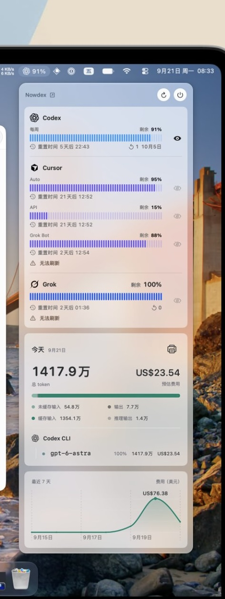

# v0.3.1 全区域视觉对照与结构草图

> **当前是结构草图，视觉源以实际客户端和公开找到的真实截图为准。** 先前自造的淡蓝卡片视觉稿已被用户否定并撤回。本文件决定 Codexio 功能放在参考 UI 的哪个位置，不能替代 Codex／Claude／Nowdex 的真实截图。用户已选择当前新版 Codex；设计未获用户整体认可前不改程序代码。

## 1. 直接视觉来源

| 表面 | 直接视觉源 | 必须照着做的元素 | 允许替换的元素 |
| --- | --- | --- | --- |
| 主窗口外壳、侧栏、导航、标题栏 | 当前新版 Codex；[官方版本说明](https://help.openai.com/en/articles/20001276-moving-to-the-new-chatgpt-desktop-app)、[新版截图来源](https://aws.amazon.com/blogs/machine-learning/get-started-with-openai-gpt-5-6-sol-terra-and-luna-on-amazon-bedrock/) | 侧栏宽度与收起方式、导航行高度、选中与悬浮状态、工具栏对齐、主内容留白 | 品牌和六个页面名称 |
| 内容详情、设置、弹窗 | Claude Desktop；[官方桌面教程和截图](https://claude.com/resources/tutorials/navigating-the-claude-desktop-app) | 字级关系、分组、表单行、详情阅读宽度、按钮克制程度 | 真实 Codexio 数据和操作 |
| 新额度小组件 | 用户 [#1](references/01-single-quota.jpg)、[#2](references/02-dual-quota.png)、[#5](references/05-segmented-styles.jpg) | 卡片比例、明暗配色、标题和大数字位置、进度条形态、细字、弱水印 | Codexio 名称、额度窗口与数值 |
| 菜单栏面板 | 用户 [#6](references/06-menu-bar.jpg) | 通透背景、圆角、顶栏、面板宽度、蓝色细密条、今日卡和七日曲线排列 | 将多个服务折成 Codexio 的 5 小时／周额度 |
| 旧请求小组件小／中／大 | 当前运行版 Codexio | **UI 整体不变**，包括字号、内容顺序、间距、颜色和进度样式 | 仅必要的 Swift 数据接口与兼容代码 |

第三方客户端的聊天框、项目、服务列表、账户信息不进入 Codexio。这里的“直接照着做”针对适用的视觉结构与交互状态；当某个参考功能在 Codexio 中不存在时，用当前产品的同类数据占据对应位置，不凭空增加新业务。

### 找到的公开桌面截图

- [新版 Codex 所在的 ChatGPT 桌面端实图](https://d2908q01vomqb2.cloudfront.net/f1f836cb4ea6efb2a0b1b99f41ad8b103eff4b59/2026/07/22/ML-21450-3.png)，来源：[AWS 官方文章](https://aws.amazon.com/blogs/machine-learning/get-started-with-openai-gpt-5-6-sol-terra-and-luna-on-amazon-bedrock/)。这张显示新版 Codex 模式的侧栏和主内容区。
- [Claude Desktop 官方首页实图](https://cdn.prod.website-files.com/68a44d4040f98a4adf2207b6/69a8c30634a6c3e545269791_69a8a456caa28723041a6eea_699e1b746d83c9fb55a56d31_698be3352261cf694fdae308_698bdd295c5f5d680c01e63c_Screenshot%25252525202026-02-09%2525252520at%25252525204.38.22%25252525E2%2525252580%25252525AFPM.png)与[工作区实图](https://cdn.prod.website-files.com/68a44d4040f98a4adf2207b6/699e1b736d83c9fb55a56d2a_698be3342261cf694fdae301_698bdd78a6031117e6bb41d6_Screenshot%2525202026-02-09%252520at%25252012.52.07%2525E2%252580%2525AFPM.png)，来源：[Claude 官方教程](https://claude.com/resources/tutorials/navigating-the-claude-desktop-app)。
- 若公开图未展示某个必要的设置或详情状态，优先参照大厂开源的 [Microsoft Code - OSS 工作台](https://github.com/microsoft/vscode)及其[界面指南](https://github.com/microsoft/vscode-docs/blob/main/api/ux-guidelines/overview.md)补全结构，不回到上一版自造的卡片样式。Code - OSS 源代码为 MIT 许可，实际 Mac 界面仍用 SwiftUI / AppKit 实现。


## 2. 主窗口通用外壳

以下仅表示位置和内容，不给 Codex／Claude 另造一套外观。六页共用当前新版 Codex 风格的原生窗口外壳，左上保留 Codexio 品牌，收起按钮进入窗口工具栏；主内容用 Claude 式安静阅读层级。

```text
┌────────────────────────────── macOS 原生标题栏 ───────────────────────────────┐
│  ● ● ●   [侧栏收起]                          页面标题／路径     [刷新] [状态] │
├──────────────────────┬────────────────────────────────────────────────────────┤
│ Codexio              │  当前页面内容                                           │
│                      │  页面局部控件靠近所作用的内容                           │
│   概览               │  主内容使用平面、留白和分隔；只在必要处使用卡片         │
│   日志               │                                                        │
│   用量               │  表格行、详情栏、设置表单沿用参考客户端的密度           │
│   订阅               │                                                        │
│   定价               │                                                        │
│   设置               │                                                        │
│                      │                                                        │
│   账户／数据状态     │                                                        │
└──────────────────────┴────────────────────────────────────────────────────────┘
```

**品牌区**：不再在一条窄行塞“图标 + 名称 + 收起”。Codexio 文字与现有 Cobalt X 图标的最终并列方式按当前 Codex 的产品切换／品牌区对齐；不使用此前草图的 Times 字标。公开截图作为布局对照，具体字号和间距在最终视觉稿中写明。

**窗口行为**：⌘K 搜索、⌘, 设置、⌘R 刷新、⌘W 关主窗口、⌘Q 退出保持。关窗后 Dock 和新菜单栏仍能打开主界面。侧栏可收起并记忆状态，窄窗口不牺牲重要数字。

## 3. 六页内容位置草图

这些草图只固定信息架构。真正的背景、字体、行高、按钮、选中与分隔取自上表的视觉源；不使用先前被否定的自造卡片样式。

### 3.1 概览

```text
概览                                           最近更新 · [刷新]

5 小时额度                       周额度
[Nowdex 式大数字、细条、重置]      [同构的额度行]

今日 / 7 天 / 30 天 / 历史
费用          Total Token          用户请求          缓存命中率

用量趋势：Token 与费用两条真实曲线                   [打开用量]

最近请求：时间 / 输入预览 / 模型 / 费用               [查看全部]
```

首屏必须先看见剩余额度与更新时间。额度数值来自本机 Codex `app-server`；未知、不适用或过期不能伪装成正常百分比。下方数据与现有概览口径相同。取消显而易见的解释句及重复边框。

### 3.2 日志：用户请求和模型调用

```text
日志       [用户请求 | 模型调用]    [日期范围]

[搜索输入、会话或 ID] [模型] [状态／档位] [来源]

┌───────────────────────────────┬───────────────────────────────┐
│  扁平列表／表格                 │  稳定详情栏                   │
│  时间   内容／模型   Token 费用 │  标题、实际请求／响应          │
│  选中行使用 Codex 式选中状态   │  费用、Token、缓存、耗时       │
│  键盘与鼠标选择一致             │  模型调用组成、复制 ID         │
└───────────────────────────────┴───────────────────────────────┘
                              [上一页]  页数  [下一页]
```

详情样式参考 Claude 的阅读层级；点击或键盘选中后稳定存在，鼠标移走不关闭。用户请求与模型调用两种模式分别显示对应字段；实际响应型号和未知档位不被猜成其他值。窄窗口可把详情放入独立视图，但不能恢复大块悬浮卡。

### 3.3 用量

```text
用量                  [今日 / 7 天 / 30 天 / 自定义] [粒度] [模型]

每日 Token · 近一年  [热力日历与实际日期]

费用          Total Token          用户请求          缓存命中率

Token / 费用趋势 [可选择曲线] [清楚标轴和单位]
```

沿用真实本地时间与当前统计口径。图例和坐标直接说明曲线，无需常驻“点击这里／悬停那里”的注释。未知价格的曲线断开，不虚构零值。

### 3.4 订阅

```text
订阅                  最近额度更新时间

个人订阅资料        5 小时额度（Nowdex 排版）  周额度（Nowdex 排版）
[编辑资料]           剩余／重置                剩余／重置

主动重置：可靠的可用次数与逐次截止信息

整周额度估值（显式标“估算”）
周期记录：周期 / 已用 / 费用估值 / 状态
```

未填写的订阅资料继续空白，不推断续费或套餐。额度与估值在视觉上分层；重置次数只展示已有可靠数据。

### 3.5 定价

```text
定价            最近同步时间                         [立即同步]

[搜索模型]                             [编辑基础价] [恢复自动价]

模型       条件       输入       缓存读取       缓存写入       输出
──────────────────────────────────────────────────────────────────
Standard / Fast / 有效上下文条件按现有数据逐行展示
```

价格表保持可读、可横向滚动。编辑只修改选中的正确模型基础价。费用、参考价与未知价的含义不能仅靠 tooltip 才明白。

### 3.6 设置：外观、数据源、应用

```text
设置侧栏           内容区
  外观     →       主题 / 侧栏 / 日志来源列
  数据源   →       本机与 SSH 列表 / Codex 路径 / 历史归属 / 重扫
  应用     →       菜单栏 / 自动更新 / 上游检测 / 刷新间隔 / 数据目录
```

设置行、开关、选择器、辅助文字及保存反馈参考 Claude Desktop。上游检测会临时改本机路由，此处保留必要的短说明和重启选择；其他普通设置不再堆叠长篇注释。

## 4. 新额度小组件：原图就是视觉目标

**现有请求小组件不在本节改造范围。** 新增的额度小组件单独出现在 WidgetKit 列表中，最小桌面尺寸为方形。下面三种样式都以附件中的原图为精确排版目标；先前被用户否定的自主 SVG 样式不复用。

| 新样式 | 要对齐的原图 | 替换规则 |
| --- | --- | --- |
| 单额度黑白卡 | [#1](references/01-single-quota.jpg) 和 [#4](references/04-quota-hierarchy.jpg) | 无额外大品牌标头；顶部刷新时间、单窗口百分比、细进度、已用／剩余、分隔线、重置时间与可用重置次数沿用原图层级。主数字若用“已用”，进度也表示已用，底部明确剩余。可在组件设置中选 5 小时或周。 |
| 双额度暖色卡 | [#2](references/02-dual-quota.png) | 黑底、两组额度、右侧大百分比、暖珊瑚连续条和重置时间，按原图比例。只替换服务名称和 5 小时／周窗口；数字含义用可见短标签说明。 |
| 双额度细刻度卡 | [#5](references/05-segmented-styles.jpg) 和 [#3](references/03-widget-variety.jpg) | 浅色与深色一对、细密等距刻度、极浅背景水印、两个额度窗口。条形填充方向与明确标示的“剩余”或“已用”一致。 |


WidgetKit 由系统决定实际展示尺寸和刷新时机。加载、失败、过期、API／自定义 provider 不适用时，保留原图的空间关系，用 `—` 和简短状态替换百分比；不能伪造 0%、100% 或重置次数。

## 5. 原生菜单栏：以图 #6 为一比一排版目标



面板从上到下按原图对齐：

1. 菜单栏状态项显示单色标记和可选额度数字；点开是窄而通透的圆角面板。
2. 顶部一行左侧 Codexio 与“打开主窗口”图标，右侧圆形刷新与退出按钮。
3. 第一张浅色半透明卡以 **Codexio / Codex 额度** 为标题，5 小时与周额度各占一行，使用原图那种细密蓝色短条；旁边写明**剩余百分比**，下方放重置时间。没有 Cursor/Grok 等别的服务段落。
4. 第二张卡按原图位置呈现今日 Token 大数字、费用估值、绿色分配条和已有的用量细分；若某项数据缺失，不增加假的分项。
5. 最后一张卡按原图位置呈现最近七日费用曲线与日期轴。仅用已有的本地用量记录绘制。
6. 关闭主窗口后面板仍可打开；刷新使用主程序同一份数据与任务。用户在设置里可关闭菜单栏显示，Dock 与应用菜单仍可重新进入主界面。

## 6. 编辑流程与状态草图

| 区域 | 结构草图与视觉来源 |
| --- | --- |
| 订阅资料、模型基础价、数据源、历史归属 | Claude 风格的原生表单：明确标题、少量成组字段、取消和具体动作按钮；不使用笼统“保存／继续” |
| 更新与上游检测重启 | 原生确认框：说明将发生的动作；提供“现在重启／稍后自行重启”等真实选项，不借悬浮说明交代重要后果 |
| 读取中、失败、过期、不适用、空日志、未定价 | 保留主布局，用明确短文案和 `—` 表达；未定价不显示 `$0.00`，额度过期不显示貌似当前的旧百分比 |

## 7. 完整设计冻结所需的最后对照

已找到新版 Codex 与 Claude 的公开实图，用户不需要再提供截图。下一版视觉稿要据这些图逐页补：侧栏与标题栏尺寸、字体、色值、圆角、间距、控件状态、浅色／深色，以及主窗口六页、设置三分区、菜单栏和新额度组件的最终对照。公开图没有的细节用上表的 Microsoft Code - OSS 开源界面作结构参考，并在稿中标明来源。用户看完并明确满意后，才执行 [开发步骤](DEVELOPMENT.md)。
