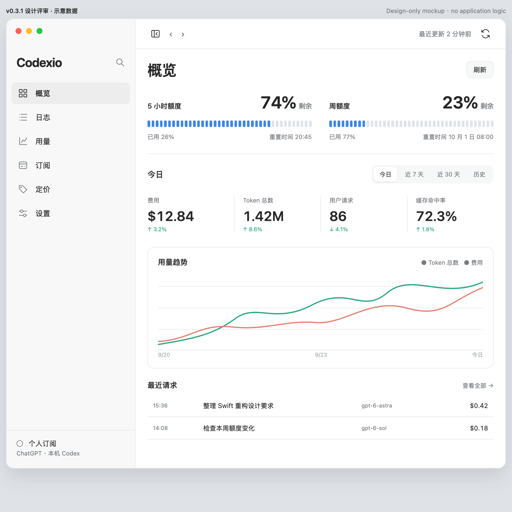
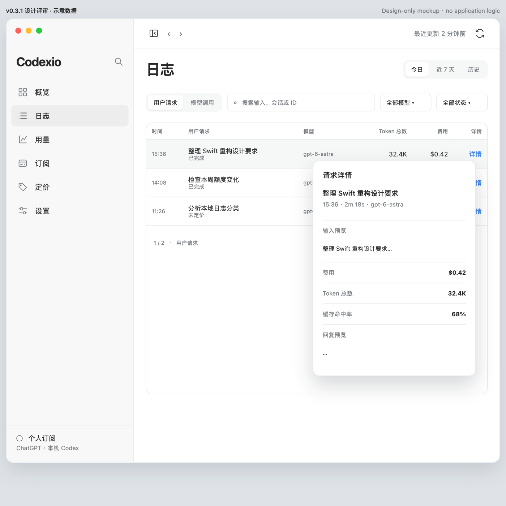
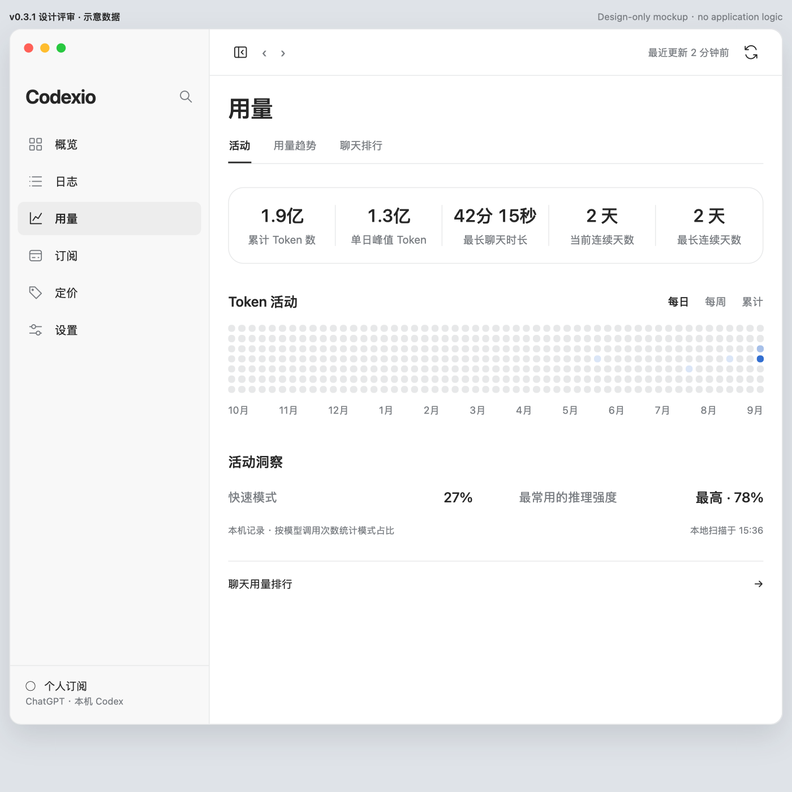
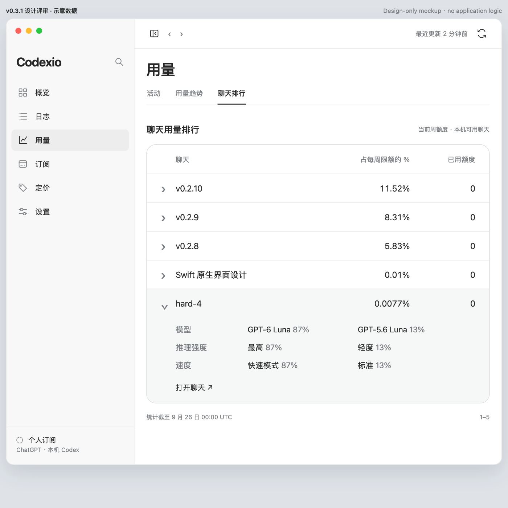
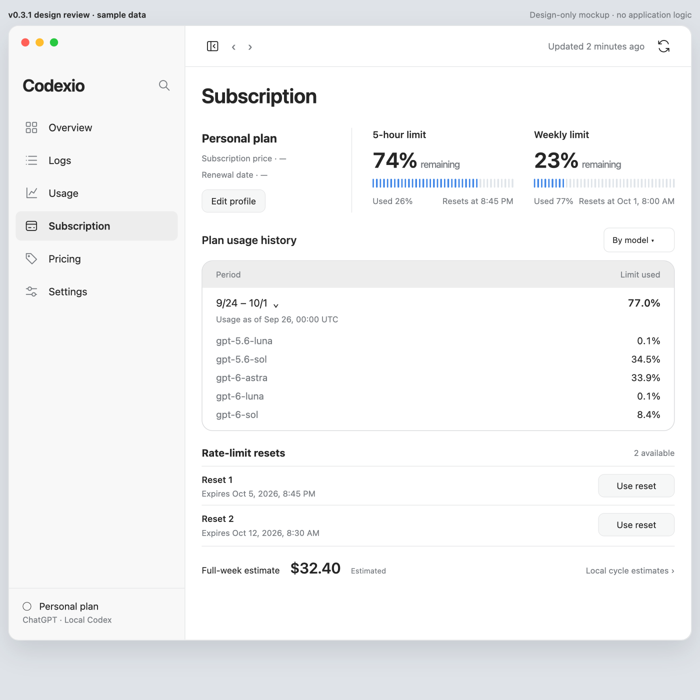
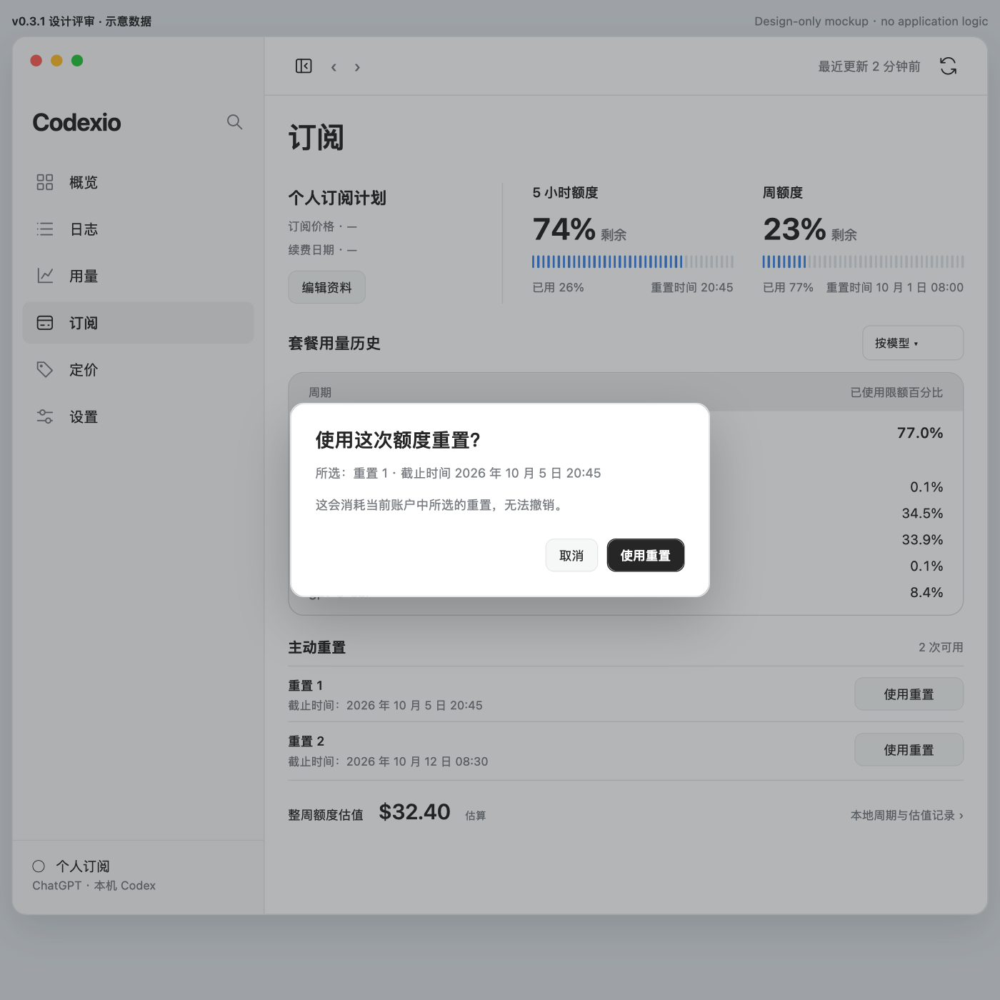
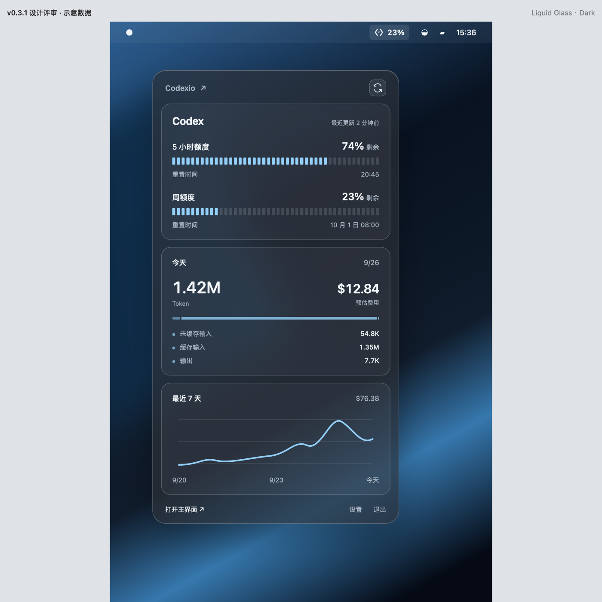
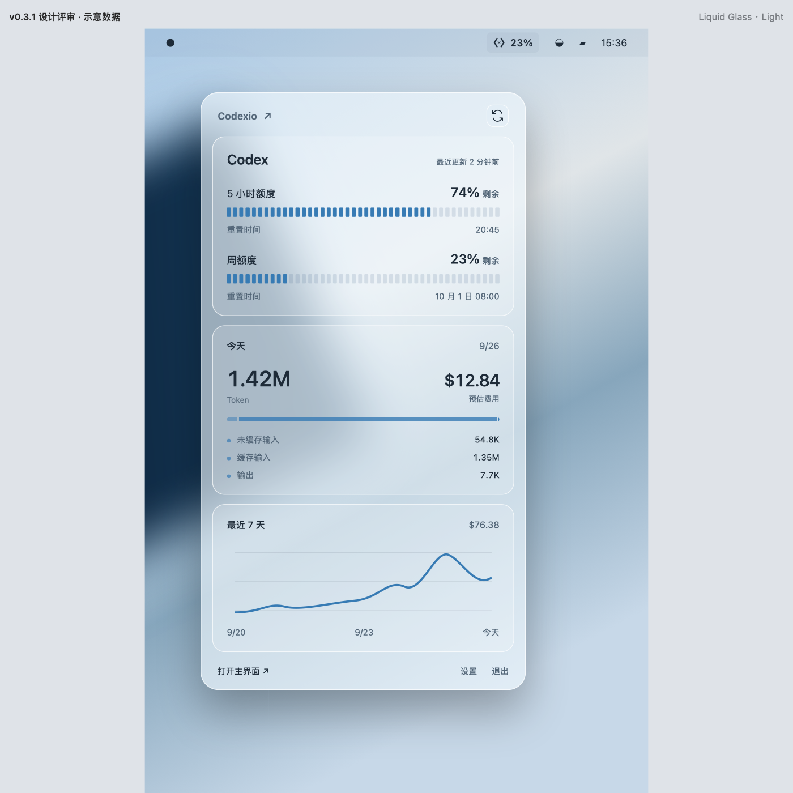

# v0.3.1 中英文静态界面稿

> 本目录只有设计评审资料：HTML/CSS 与渲染预览图，不接入 Codexio 程序、不执行额度重置，也不读取用户数据。所有数字、模型、价格和请求文字均为示意。界面字体使用 macOS 的 `-apple-system` 字体栈，参考图仍以 [VISUAL_SPEC.md](../VISUAL_SPEC.md) 指定的本地原图为准。

[打开评审索引](index.html)可以按区域查看中文和英文稿。下表的预览图可以直接在 Markdown 中打开；HTML 文件保留可放大查看的完整布局。窗口稿已改为更宽的 1380 pt，主界面额度数字约 34 pt。日志恢复末列“详情 / Details”的悬停浮层，不占右侧固定宽度。订阅页逐张列出重置和完整截止时间，每行末尾独立提供“使用重置 / Use reset”，确认框会再次指明所选条目。

本轮新增：旧版实际导航图标、带 23% 状态项的深浅玻璃菜单、本机活动五指标与洞察、套餐周周期按模型展开、聊天额度排行与缺失状态。**图 5 活动页只计算本机数据**；图 6／7 使用服务端额度。界面中的演示数字不表示真实账户已接入，接口条件见 [数据规范](../DATA_CAPABILITIES.md)。

| 区域 | 中文 HTML／预览 | English HTML／preview |
| --- | --- | --- |
| 概览 | [HTML](overview-zh.html) · [PNG](previews/overview-zh.html.png) | [HTML](overview-en.html) · [PNG](previews/overview-en.html.png) |
| 日志表格 | [HTML](logs-zh.html) · [PNG](previews/logs-zh.html.png) | [HTML](logs-en.html) · [PNG](previews/logs-en.html.png) |
| 日志悬停详情状态 | [HTML](logs-detail-zh.html) · [PNG](previews/logs-detail-zh.html.png) | [HTML](logs-detail-en.html) · [PNG](previews/logs-detail-en.html.png) |
| 用量 · 本机活动 | [HTML](usage-zh.html) · [PNG](previews/usage-zh.html.png) | [HTML](usage-en.html) · [PNG](previews/usage-en.html.png) |
| 用量 · 原有趋势 | [HTML](usage-trends-zh.html) · [PNG](previews/usage-trends-zh.html.png) | [HTML](usage-trends-en.html) · [PNG](previews/usage-trends-en.html.png) |
| 用量 · 聊天额度排行与展开 | [HTML](usage-threads-zh.html) · [PNG](previews/usage-threads-zh.html.png) | [HTML](usage-threads-en.html) · [PNG](previews/usage-threads-en.html.png) |
| 用量 · 额度明细未提供 | [HTML](usage-unavailable-zh.html) · [PNG](previews/usage-unavailable-zh.html.png) | [HTML](usage-unavailable-en.html) · [PNG](previews/usage-unavailable-en.html.png) |
| 订阅与使用重置 | [HTML](subscription-zh.html) · [PNG](previews/subscription-zh.html.png) | [HTML](subscription-en.html) · [PNG](previews/subscription-en.html.png) |
| 使用重置确认框 | [HTML](reset-confirm-zh.html) · [PNG](previews/reset-confirm-zh.html.png) | [HTML](reset-confirm-en.html) · [PNG](previews/reset-confirm-en.html.png) |
| 定价 | [HTML](pricing-zh.html) · [PNG](previews/pricing-zh.html.png) | [HTML](pricing-en.html) · [PNG](previews/pricing-en.html.png) |
| 设置 · 外观 | [HTML](settings-appearance-zh.html) · [PNG](previews/settings-appearance-zh.html.png) | [HTML](settings-appearance-en.html) · [PNG](previews/settings-appearance-en.html.png) |
| 设置 · 数据源 | [HTML](settings-data-zh.html) · [PNG](previews/settings-data-zh.html.png) | [HTML](settings-data-en.html) · [PNG](previews/settings-data-en.html.png) |
| 设置 · 应用 | [HTML](settings-app-zh.html) · [PNG](previews/settings-app-zh.html.png) | [HTML](settings-app-en.html) · [PNG](previews/settings-app-en.html.png) |
| 菜单栏 · 深色玻璃 | [HTML](menu-zh.html) · [PNG](previews/menu-zh.html.png) | [HTML](menu-en.html) · [PNG](previews/menu-en.html.png) |
| 菜单栏 · 浅色玻璃 | [HTML](menu-light-zh.html) · [PNG](previews/menu-light-zh.html.png) | [HTML](menu-light-en.html) · [PNG](previews/menu-light-en.html.png) |

小组件的直接目标仍是用户提供的 [Nowdex 单额度](../references/01-single-quota.jpg)、[双额度](../references/02-dual-quota.png)和[刻度条](../references/05-segmented-styles.jpg)原图；此前劣质仿制草图已撤回。已有请求小组件的小、中、大 UI 完全保留，只会在英文系统中替换固定文字标签。
